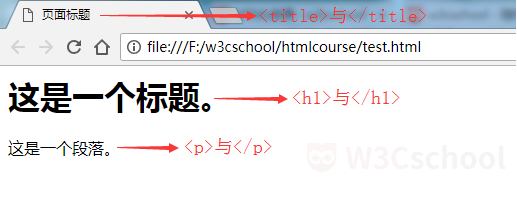

# 开始学习 HTML
HTML 指的是超文本标记语言（英语：HyperText Markup Language），是用来描述网页的一种语言。
*   HTML 不是一种编程语言，而是一种标记语言，它有一套标记标签 。
*   HTML 使用标记标签来描述网页。
*   HTML 文档包含了 HTML 标签及文本内容，HTML文档也叫做 Web 页面。
您可以使用 HTML 来建立自己的 Web 站点，HTML 运行在浏览器上，由浏览器来解析。  
在本课程中，您将学习如何使用 HTML 来创建站点。
# HTML 网页结构
下面是一个可视化的 HTML 页面结构实例：
```angular2  
<html>
   <head>
   <title>页面标题</title>
   </head>
   <body>
     <h1>这是一个标题。</h1>
     <p>这是一个段落。</p>
   </body>
</html>
   
```


**我们来解析一下**  
```angular2
<html> 与 </html> 之间的文本描述网页。
<head> 与 </head> 之间的文本描述文档的元数据。
<title> 与 </title> 之间的文本描述文档的标题。
<body> 与 </body> 之间的文本是可见的页面内容。
<h1> 与 </h1> 之间的文本被显示为一个大标题。
<p> 与 </p> 之间的文本被显示为一个段落。
```
只有body区域才会在浏览器中显示，显示效果如下图：  


# html 标签
html 元素定义了整个 HTML 文档。  
这个元素拥有一个开始标签html ，以及一个结束标签/html。
```angular2
<html>
 …
</html>
```

# head 标签
head 元素包含了所有的头部标签元素。  
head  元素必须包含文档的标题（title），可以包含脚本、样式、meta 信息以及其他更多的信息。
```angular2
    <html>
      <head>…</head>
    </html>
```
# body 标签
body 元素定义文档的主体。  
body 元素包含文档的所有内容（比如文本、超链接、图像、表格和列表等等）。  
下面是 HTML 的基本结构：
```angular2
<html>
  <head>…</head>
  <body>
  …
  </body>
</html>

```
# HTML 编辑器
HTML 文件是文本文件，因此你可以使用任何文本编辑器来创建 HTML 文件。  
有一些很不错的 HTML 编辑器可用，你可以选择适合你自己的那个。W3Cschool 为大家推荐几款常用的编辑器：  
* **Notepad++：** [Notepad++](https://notepad-plus-plus.org/)
* **Sublime Text：** [Sublime Text](http://www.sublimetext.com/)
* **VS Code：** [VS Code](https://code.visualstudio.com/)  
你可以从以上软件的官网中下载对应的软件，按步骤安装即可。