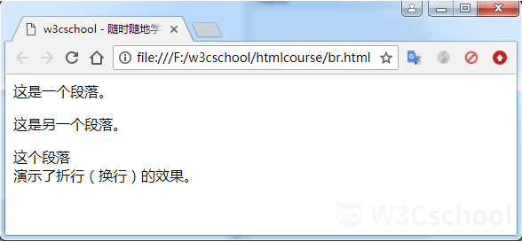
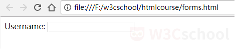

# 第一章 介绍
## 开始学习 HTML
HTML 指的是超文本标记语言（英语：HyperText Markup Language），是用来描述网页的一种语言。
*   HTML 不是一种编程语言，而是一种标记语言，它有一套标记标签 。
*   HTML 使用标记标签来描述网页。
*   HTML 文档包含了 HTML 标签及文本内容，HTML文档也叫做 Web 页面。
您可以使用 HTML 来建立自己的 Web 站点，HTML 运行在浏览器上，由浏览器来解析。  
在本课程中，您将学习如何使用 HTML 来创建站点。
## HTML 网页结构
下面是一个可视化的 HTML 页面结构实例：
```angular2  
<html>
   <head>
   <title>页面标题</title>
   </head>
   <body>
     <h1>这是一个标题。</h1>
     <p>这是一个段落。</p>
   </body>
</html>
   
```


**我们来解析一下**  
```angular2
<html> 与 </html> 之间的文本描述网页。
<head> 与 </head> 之间的文本描述文档的元数据。
<title> 与 </title> 之间的文本描述文档的标题。
<body> 与 </body> 之间的文本是可见的页面内容。
<h1> 与 </h1> 之间的文本被显示为一个大标题。
<p> 与 </p> 之间的文本被显示为一个段落。
```
只有body区域才会在浏览器中显示，显示效果如下图：  


## html 标签
html 元素定义了整个 HTML 文档。  
这个元素拥有一个开始标签html ，以及一个结束标签/html。
```angular2
<html>
 …
</html>
```

## head 标签
head 元素包含了所有的头部标签元素。  
head  元素必须包含文档的标题（title），可以包含脚本、样式、meta 信息以及其他更多的信息。
```angular2
    <html>
      <head>…</head>
    </html>
```
## body 标签
body 元素定义文档的主体。  
body 元素包含文档的所有内容（比如文本、超链接、图像、表格和列表等等）。  
下面是 HTML 的基本结构：
```angular2
<html>
  <head>…</head>
  <body>
  …
  </body>
</html>

```
## HTML 编辑器
HTML 文件是文本文件，因此你可以使用任何文本编辑器来创建 HTML 文件。  
有一些很不错的 HTML 编辑器可用，你可以选择适合你自己的那个。W3Cschool 为大家推荐几款常用的编辑器：  
* **Notepad++：** [Notepad++](https://notepad-plus-plus.org/)
* **Sublime Text：** [Sublime Text](http://www.sublimetext.com/)
* **VS Code：** [VS Code](https://code.visualstudio.com/)  
你可以从以上软件的官网中下载对应的软件，按步骤安装即可。  
## 创建 HTML 文件
接下来，我们将演示如何使用 Sumlime Text 编辑器来创建 HTML 文件。
***
**步骤 1：新建 HTML 文件**  
在 Sublime Text 安装完成后，选择" 文件(F)->新建(N) "，在新建的文件中输入以下代码：
```angular2
<!DOCTYPE html>
<html>
<head>
<meta charset="utf-8">
<title>w3cschool - 随时随地学编程</title>
</head>
<body>
  <h1>我的第一个标题。</h1>
  <p>我的第一个段落。</p>
</body>
</html>
```
如下图所示：
  
> 提示：对于中文网页需要使用 `````<meta charset="utf-8">````` 声明编码，否则会出现乱码。有些浏览器（如 360 浏览器）会设置 GBK 为默认编码，则你需要设置为 <meta charset="gbk">。
## 保存 HTML 文件
### 步骤 2：另存为 HTML 文件
然后选择" 文件(F)->另存为(A) "，文件名为 first.html。  
如下图所示：
  
当您保存 HTML 文件时，既可以使用 .htm 也可以使用 .html 后缀名。两种后缀名没有区别，完全根据您的喜好，推荐使用 .html。
## 运行 HTML 文件
### 步骤 3：在浏览器中运行这个 HTML 文件
启动您的浏览器，然后选择" 文件 "菜单的" 打开文件 "命令，或者直接在文件夹中双击您的 HTML 文件。  
运行显示结果如下图：  

## 代码初体验，制作第一个网页
### 任务：请你试一试，制作你的第一个网页。  
给p元素之间添加文本“你好HTML”。显示如下图所示：

## HTML 元素
HTML 文档由 HTML 元素定义。  
HTML 元素```以开始标签起始，以结束标签终止，元素的内容是开始标签与结束标签之间的内容。```   
HTML 文档由嵌套的 HTML 元素构成。  
```实例:``` 这个 HTML 文档包含了三个 HTML 元素。
```angular2
<html>
  <body>
    <p>这是第一个段落。</p>
  </body>
</html>
```
## HTML 空元素
没有内容的 HTML 元素被称为空元素。空元素是在开始标签中关闭的。  
例如，`````<br>````` 就是没有关闭标签的空元素，`````<br>````` 标签定义折行（换行）。  
在开始标签中添加斜杠，比如 ```<br />```，是关闭空元素的正确方法。  
```angular2
<html>
  <body>
    <p>这是一个段落。</p>
    <p>这是一个<br />换行。</p>
  </body>
</html>
```  
> **提示：** 即使 ```<br>``` 目前在所有浏览器中都是有效的，但为了获得更长远的保障，w3cschool 建议使用 ```<br />```。
## HTML 属性
*属性* 是 HTML 元素提供的附加信息。
+ HTML 元素可以设置属性
+ 属性可以在元素中添加附加信息
+ 属性一般描述于开始标签
+ 属性总是以名称/值对的形式出现，比如：name="value"。
### 属性实例：
这是一个链接使用了 href 属性。  
```angular2
<a href="http://www.w3cschool.cn">这是一个链接</a>
```
## HTML 属性值
属性值应该始终被包括在```引号内```。  
``双引号``是最常用的，不过使用单引号也没有问题。  
在某些个别的情况下，比如属性值本身就含有双引号，那么您必须使用单引号，例如：
```angular2
name='Bill "HelloWorld" Gates'
```
> ```提示：```属性和属性值对大小写不敏感。不过，推荐标准中推荐小写的属性/属性值。  
## HTML 常用的属性
下面列出了 HTML 常用的属性，适用于大多数 HTML 元素。   
*** 
> |属性|描述|
|:--------- |:------- |
|class			|为 html 元素定义一个或多个类名（类名从样式文件引入）
|id				|定义元素的唯一 id
|style			|规定元素的内联样式
|title	    	|规定元素的额外信息（可在工具提示中显示）
## HTML class 与 id 属性
### class 属性 
class 属性为 HTML 元素定义一个或多个类名。  
class 属性通常用于指向样式表中的类。 
#### 例子：
```
<p class="intro">这是一个段落。</p>
```
### id 属性
id 属性定义 HTML 元素的唯一的 id。  
id 在 HTML 文档中必须是唯一的。 
#### 例子：
```angular2
<h1 id="header">w3cschool</h1>
```
# 第二章 HTML 基础
## HTML 标题
HTML 标题（Heading）是通过 ```<h1> - <h6>``` 标签进行定义的。  
根据重要性排列，```<h1>``` 定义最大的标题，```<h6>``` 定义最小的标题。  
下面的实例定义了所有标题。
```angular2
<h1>这是标题 1</h1>
<h2>这是标题 2</h2>
<h3>这是标题 3</h3>
<h4>这是标题 4</h4>
<h5>这是标题 5</h5>
<h6>这是标题 6</h6>
```
在浏览器中显示如下  

> ### 提示：
> 用户可以通过标题来快速浏览您的网页，所以用标题来呈现文档结构是很重要的。  
> 应该将 h1 用作主标题（最重要的），其后是 h2（次重要的），再其次是 h3，以此类推。
## HTML 水平线
```<hr />``` 是一个空元素，这里的“hr”是“水平线（horizontal rule）”的意思。  
```<hr />``` 标签在 HTML 页面的作用是创建水平线。  
```<hr />``` 元素可用于分隔 HTML 页面中的内容。
```angular2
<hr />
<p>这是一个段落。</p>

<hr />
<p>这是另一个段落。</p>
```
## HTML 注释
我们可以将注释插入 HTML 代码中，这样可以提高其可读性，使代码更易被人理解。  
但浏览器会忽略注释，也不会显示它们。
### HTML 注释写法如下：
```angular2
<!-- 这是一个注释 --> 
```
在添加注释时，开始括号之后（左边的括号）需要紧跟一个叹号，但结束括号之前（右边的括号）不需要。
> 提示：合理地使用注释可以对未来的代码编辑工作产生帮助。
## 使用 ```<h2>``` 标签显示标题
> 任务：请你试一试，亲自感受下 ```<h2>``` 标签的使用。  

在h1元素下面创建一个h2元素，h2元素里面的文本为“你好HTML”。显示如下图所示：

## HTML 段落
创建段落，是通过 ```<p>``` 标签定义的。
### 实例：
```angular2
<p>这是一个段落。</p>
<p>这是另一个段落。</p>
```
在浏览器中显示如下：  

> 提示：浏览器会自动地在段落的前后添加空行。  
## HTML 折行
如果你希望在不产生一个新段落的情况下进行折行（换行），请使用 ```<br>``` 标签。  
```<br>``` 标签是一个空标签，意味着它没有结束标签。
### 实例：
```angular2
<p>这是一个段落。</p>
<p>这是另一个段落。</p>
<p>这个段落<br>演示了折行（换行）的效果。</p>
```
在浏览器中显示如下：  

> #### 提示：
> 请使用 ```<br>``` 标签来输入空行，而不是分割段落。
> 在写地址信息或者写诗词时 <br> 标签非常有用。
## HTML 格式化标签
HTML 使用 ```<b>``` 标签与 ```<i>``` 标签对输出的文本进行格式化，用来定义 **粗体** 和 *斜体*。  
这些 HTML 标签被称为格式化标签。
### 下面是常用的 HTML 文本格式化标签。

## HTML 文本格式化标签
下面是一个 HTML 文本格式化的实例。  
每个段落都运用了不同的格式化标签，来演示每个标签的作用。
```angular2
 <p><b>定义粗体文本</b></p>
 <p><em>定义着重文字</em></p>
 <p><i>定义斜体字</i></p>
 <p><small>定义小号字</small></p>
 <p><strong>定义重要的文本</strong></p>
 <p>定义<sub>下标字</sub></p>
 <p>定义<sup>上标字</sup></p>
 <p><ins>定义插入字</ins></p>
 <p><del>定义删除字</del></p>
```
在浏览器中显示如下：  

## ```<a>``` 标签
HTML 使用 ```<a>``` 标签来设置超文本链接。  
超链接可以是一个字，一个词，或者一组词，也可以是一幅图像，你可以点击这些内容来跳转到新的文档或者当前文档中的某个部分。  
在 ```<a>``` 标签中，使用 href 属性来描述链接的目标地址。  
链接的 HTML 代码很简单。它类似这样
```angular2
<a href="url">链接文本</a>
```
## 创建超链接
在下面的例子中，定义了 w3cschool 网站的超链接，点击这个超链接会把你带到 w3cschool 的首页。
```angular2
<a href="https://www.w3cschool.cn">访问w3cschool</a>
```
在浏览器中显示如下：

默认情况下，链接将以以下形式出现在浏览器中： 
+ 一个未访问过的链接显示为蓝色字体并带有下划线。
+ 访问过的链接显示为紫色并带有下划线。
+ 点击链接时，链接显示为红色并带有下划线。
> 提示：如果为这些超链接设置了 CSS 样式，展示样式会根据 CSS 的设定而显示。
##  HTML <a> target 属性
在 <a> 标签中使用 target 属性，你可以规定在何处打开链接文档。  
target 属性值有：
+ _blank：在新窗口中打开被链接文档。
+ _self：默认。在相同的框架中打开被链接文档。
+ _parent：在父框架集中打开被链接文档。
+ _top：在整个窗口中打开被链接文档。
+ framename：在指定的框架中打开被链接文档。  
实例：下面的链接会在新窗口打开文档。
```angular2
<a href="https://www.w3cschool.cn" target="_blank">访问w3cschool</a>
```
## 使用 <a> 标签链接到另一个页面
### 任务：请你试一试，亲自感受下 <a> 标签的使用。
在p元素下方创建一个a元素，并为a元素添加href属性，使其指向此URL：  
https://www.w3cschool.cn，再添加target属性的值为 _blank ，使链接在新窗口中打开，a元素里面的文本为“访问w3cschool。显示如下图所示：

## HTML ```<head>``` 元素
```<head>``` 元素包含了所有的头部标签元素。  
在 ```<head>```元素中你可以插入脚本（scripts）, 样式文件（CSS），及各种meta信息。  
可以添加在头部区域的元素标签为：```<title>, <style>, <meta>, <link>, <script>, <noscript>,<base>```。

****
### 下面是 ```<head>``` 元素包含的头部标签元素列表：

> 提示：不要担心本节中您还没有学过的标签，您将在接下来的小节中学到它们。
## ```<title>``` 元素
```<title>``` 标签定义了 HTML 文档的标题，在所有 HTML 文档中是必需的。  
```<title>``` 元素：
+ 定义浏览器工具栏中的标题
+ 提供页面被添加到收藏夹时的标题
+ 显示在搜索引擎结果中的页面标题
```
<html>
   <head>
       <title>…</title>
   </head>
</html>
```
## HTML CSS介绍
CSS （层叠样式表又称为级联样式表，英文 Cascading Style Sheets 的缩写）是用于渲染 HTML 元素标签的样式。  
CSS 是 HTML 的搭档。在编码过程中，它们发挥不同的作用：
+ HTML 负责网页的具体内容（结构）
+ CSS 则修饰网页的表现形式（布局）  
CSS 可以通过以下方式添加到HTML中：
+ 内联样式：在HTML元素中使用“style”属性。
+ 内部样式表：在HTML文档头部 ```<head>``` 区域使用 ```<style>``` 元素来包含 CSS。
+ 外部引用：使用外部CSS文件。
> 最好的方式是通过外部引用CSS文件。  
> 提示：您可以通过 CSS 微课 学习更多的 CSS 知识。
## 内联样式
当特殊的样式需要应用到个别元素时，就可以使用内联样式。   
使用内联样式的方法是在相关的标签中使用样式属性。样式属性可以包含任何 CSS 属性。  
### 内联样式实例：
我们使用font-family（字体），color（颜色），和font-size（字体大小）属性来定义字体的样式。
```angular2
<h1 style="font-family:arial;">w3cschool</h1>
<p style="font-family:arial;color:red;font-size:20px;">随时随地学编程</p>
```
在浏览器中显示如下：  

## HTML 内联样式实例
使用 text-align（文字对齐）属性指定文本的水平与垂直对齐方式：
```angular2
<!DOCTYPE html>
<html>
<head> 
<meta charset="utf-8"> 
<title>内联样式实例 - w3cschool</title> 
</head>
<body>

<h1 style="text-align:center;">居中对齐的标题</h1>
<p>这是一个段落。</p>
```
## 内部样式表
当单个文件需要特别样式时，就可以使用内部样式表。你可以在```<head>``` 部分通过 ```<style>```标签定义内部样式表。
### 内部样式表实例：
我们在 HTML 文档中使用 ```<style>``` 元素。 
```angular2
<head>
<style type="text/css">
 h1 {color:red;}
 p {color:blue;}
</style>
</head>
```
在浏览器中显示如下：  

## 外部样式表
当样式需要被应用到很多页面的时候，外部样式表将是理想的选择。使用外部样式表，你就可以通过更改一个文件来改变整个站点的外观。
### 外部样式表实例：
```angular2
<head>
<link rel="stylesheet" type="text/css" href="/statics/demosource/styles.css">
</head>
```
在浏览器中显示如下：

## `````` 标签
在 HTML 中，图像由 `````` 标签定义。  
`````` 是空标签，它只包含属性，并且没有闭合标签。  
要在页面上显示图像，你需要使用源属性（src）。源属性的值是图像的 URL 地址。
### 定义图像的语法是：
```angular2

```
## 图像位置
URL 指存储图像的位置，你需要为位于引号之间的 src 属性放置图像位置。  
例如， 如果名为 "index-logo.png" 的图像位于 www.w3cschool.cn 的 images 目录中，那么其 URL 为  
https://www.w3cschool.cn/images/index-logo.png。  
### 实例：
```angular2

```
在浏览器中显示如下：

## 图像 alt 属性
**alt** 属性用来为图像定义一串预备的可替代的文本。  
替代文本属性的值是用户定义的。
### 例如：
```angular2

```
在浏览器无法载入图像时，替代文本属性告诉读者他们失去的信息。此时，浏览器将显示这个替代性的文本而不是图像。 
> 提示：为页面上的图像都加上替换文本属性是个好习惯，这样有助于更好的显示信息，并且对于那些使用纯文本浏览器的人来说是非常有用的。
## 设置图像的宽度与高度
width（宽度）与 height（高度）属性用于设置图像的宽度与高度。  
width 与 height 属性值可以以 px（像素）或 %（百分比）形式指定，默认单位为 px（像素）。  
### 实例：
```angular2

```
在浏览器中显示如下：

## HTML 无序列表
HTML 支持有序列表、无序列表和自定义列表。  
无序列表是一个项目的列表，此列项目使用粗体圆点（典型的小黑圆圈）进行标记。  
```<ul>``` 标签定义无序列表。将`` <ul>`` 标签与```<li>``` 标签一起使用，创建无序列表。  
实例：下面是一个无序列表。
```angular2
<ul>
  <li>苹果</li>
  <li>香蕉</li>
  <li>菠萝</li>
</ul> 
```
在浏览器中显示如下：  

## HTML 有序列表
有序列表也是一列项目，列表项目使用数字进行标记  
```<ol>``` 标签定义了一个有序列表，列表排序以数字来显示。使用 ```<li>``` 标签来定义列表选项。  
实例：下面是个有序列表。
```angular2
<ol>
  <li>苹果</li>
  <li>香蕉</li>
  <li>菠萝</li>
</ol> 
```
在浏览器中显示如下：  
  
## HTML 自定义列表
自定义列表不仅仅是一列项目，而是项目及其注释的组合。  
自定义列表以 ```<dl>``` 标签开始。每个自定义列表项以 ```<dt>``` 开始。每个自定义列表项的描述以 ```<dd>``` 开始。  
实例：下面是一个自定义列表。  
```angular2
<dl>
  <dt>苹果</dt>
    <dd>又大又红</dd>
  <dt>香蕉</dt>
    <dd>又香又甜</dd>
</dl>
```
在浏览器中显示如下：  

## HTML 块级元素
大多数 HTML 元素被定义为**块级元素**或**内联元素**。
---
HTML 区块元素  
块级元素在浏览器显示时，通常会以新行来开始（和结束）。  
例如： ```<div>, <h1>, <p>, <ul>, <table>``` 元素。
### 实例：
```angular2
<h1>w3cschool</h1>
<p>随时随地学编程</p>
```
在浏览器中显示如下：  

## HTML 内联元素
内联元素在显示时通常不会以新行开始。  
例如：`````<span>, <a>, , <b>, <td>````` 元素。
### 实例：
```angular2
<span>红色</span>
<span>蓝色</span>
<span>绿色</span>
```
在浏览器中显示如下：   

## HTML ```<div>``` 元素  
```<div>``` 元素是块级元素，它可用于组合其他 HTML 元素的容器。
```<div>``` 元素没有特定的含义。除此之外，由于它属于块级元素，浏览器会在其前后显示折行（换行）。  
如果与 CSS 一同使用，<div> 元素可用于对大的内容块设置样式属性。  
实例：文档中的 ```<div>``` 元素区域将显示为红色。
```angular2
<div style="color:#FF0000">
  <h1>这是一个在 div 元素中的标题。</h1>
  <p>这是一个在 div 元素中的文本。</p>
</div>
```
在浏览器中显示如下：  
  
> 提示：```<div>``` 元素的另一个常见的用途是文档布局。它取代了使用表格定义布局的老式方法。
## HTML ```<span>``` 元素
```<span>``` 元素是内联元素，可用作文本的容器。  
```<span>``` 元素也没有特定的含义。  
当与 CSS 一同使用时，<span> 元素可用于为部分文本设置样式属性。  
实例：使用 <span> 元素对文本中的一部分进行设置样式。
```angular2
<p>我的哥哥有 <span style="color:0000FF;font-weight:bold">蓝色</span> 的球鞋，我的姐姐有 <span style="color:FF0000;font-weight:bold">红色</span> 的球鞋。</p>
```
在浏览器中显示如下：

## ```<iframe>``` 标签
通过使用框架，你可以在同一个浏览器窗口中显示不止一个页面。  
```<iframe>``` 标签规定一个内联框架。  
一个内联框架被用来在当前 HTML 文档中嵌入另一个文档。  
实例：标记一个内联框架。
```angular2
<iframe src="https://www.w3cschool.cn"></iframe>
```
在浏览器中显示如下：
  
> 提示：你可以把需要的文本放置在 ```<iframe> 和 </iframe>``` 之间，这样就可以应对不支持 ```<iframe> 的浏览器（一些旧的浏览器不支持iframe）```。
## 定义 ```<iframe>``` 标签的高度与宽度
height 和 width 属性用来定义 ```<iframe>``` 标签的高度与宽度。  
属性默认以 px（像素）为单位，但是你可以指定其按比例显示 (如："90%")。
### 实例：   
```angular2
<iframe src="/statics/demosourse/demo_iframe.htm" width="300" height="300"></iframe>
```
在浏览器中显示如下：  

## 定义 ```<iframe>``` 标签是否显示边框
frameborder 属性用于定义 ```<iframe>``` 是否显示边框。  
frameborder 属性默认值为“1”，表示开启边框。设置 frameborder 属性值为 "0" ，则表示移除 ```<iframe>``` 的边框。
### 实例：
```angular2
<iframe src="/statics/demosourse/demo_iframe.htm" width="300" height="300" frameborder="0">
```
在浏览器中显示如下：
  
> 提示：HTML5 不支持 ```<iframe>``` frameborder 属性，请使用 CSS 设置样式代替。
## HTML 颜色
HTML 颜色由一个十六进制符号来定义，这个符号由红色、绿色和蓝色的值组成（RGB）。  
每种颜色的最小值是 0（十六进制：#00），最大值是 255（十六进制：#FF）。  
RGB 模型如下图所示：  

## HTML 颜色值
HTML 三种颜色 红，绿，蓝的组合从 0 到 255，一共有1600万种不同颜色(256 x 256 x 256)。  
下面的表格给出了由三种颜色混合而成的具体效果，不同的值都显示了不同的颜色。  

## HTML 脚本标签
向 HTML 添加脚本，使HTML 页面具有更强的动态性和交互性。  
下面是 HTML 的脚本标签：  

> 提示：学习更多关于 Javascript 知识，请查看 JavaScript 微课。
## HTML ```<script>``` 标签
```<script>``` 标签用于定义客户端脚本，比如 JavaScript。  
```<script>``` 元素既可包含脚本语句，也可通过 src 属性指向外部脚本文件  
JavaScript 最常用于图片操作、表单验证以及内容动态更新。  
实例：下面的脚本会向浏览器输出"Hello W3Cschool!"：
```angular2
<script>
document.write("Hello W3Cschool!");
</script>
```
在浏览器中显示如下：  

## HTML ```<noscript>``` 标签
```<noscript>``` 标签提供无法使用脚本时的替代内容，比方在浏览器禁用脚本时，或浏览器不支持客户端脚本时。  
```<noscript>``` 元素可包含普通 HTML 页面的 body 元素中能够找到的所有元素。  
只有在浏览器不支持脚本或者禁用脚本时，才会显示 <noscript> 元素中的内容。  
### 实例：
```angular2
<script>
document.write("Hello W3Cschool!")
</script>
<noscript>抱歉，您的浏览器不支持 JavaScript!</noscript>
```
在浏览器中显示如下：  

## HTML 实体
在 HTML 中，某些字符是预留的。  
在 HTML 中不能使用小于号（<）和大于号（>），这是因为浏览器会误认为它们是标签。  
如果希望正确地显示预留字符，我们必须在 HTML 源代码中使用字符实体。一些在键盘上找不到的字符也可以使用字符实体来替换。  
### 字符实体类似这样：
```angular2
&entity_name;
或
&#entity_number;
```
比如说显示小于号，我们必须这样写：&lt; 或 &#60。 
## HTML 字符实体
HTML 中的常用字符实体是不间断空格（&nbsp;）。  
如果您在文本中按 4 个空格，在显示该页面之前，浏览器会删除它们中的 3 个。如需在页面中增加空格的数量，您需要使用 &nbsp; 字符实体。  
下面是常见的 HTML 实体列表：  

> 提示：虽然 HTML 不区分大小写，但实体名称对大小写敏感。
# 第三章 表格
## HTML 表格介绍
HTML 表格由 ```<table>``` 标签来定义。  
一个 HTML 表格包括 ```<table>``` 元素，一个或多个 ```<tr>```、```<th>``` 以及 ```<td>``` 元素。  
```<tr>``` 元素定义表格行，```<th>``` 元素定义表头，```<td>``` 元素定义表格单元。  
实例：下面是一个包含两行三列的表格。
```angular2
<table border="1">
    <tr>
        <td>row 1, cell 1</td>
        <td>row 1, cell 2</td>
	<td>row 1, cell 3</td>
    </tr>
    <tr>
        <td>row 2, cell 1</td>
        <td>row 2, cell 2</td>
	<td>row 2, cell 3</td>
    </tr>
</table>
```
在浏览器中显示如下：  

## HTML 表格标签
HTML 表格常用的标签有 ```<table>、<tr>、<th>、<td>``` 标签。  
更复杂的 HTML 表格也可能包括 ```<caption>、<col>、<colgroup>、<thead>、<tfoot> 以及 <tbody>``` 标签，我们只需要大概了解一下定义。  
下面是 HTML 表格标签描述列表：

## HTML 表格边框属性
border 属性规定表格单元周围是否显示边框。  
如果不定义边框属性，表格将不显示边框。  
border 属性值为 "1" 显示表格的边框是 1 像素宽。  
实例1：下面是一个带有边框的表格。
```angular2
<table border="1">
    <tr>
        <td>苹果</td>
        <td>香蕉</td>
	<td>樱桃</td>
    </tr>
    <tr>
        <td>葡萄</td>
        <td>柠檬</td>
	<td>草莓</td>
    </tr>
</table>
```
在浏览器中显示如下：  
  
实例2：下面是一个没有边框的表格。
```angular2
<table>
    <tr>
        <td>苹果</td>
        <td>香蕉</td>
	<td>樱桃</td>
    </tr>
    <tr>
        <td>葡萄</td>
        <td>柠檬</td>
	<td>草莓</td>
    </tr>
</table>
```
在浏览器中显示如下：  

## HTML 表格表头
HTML 表格的表头使用 ```<th>``` 标签进行定义。  
大多数浏览器会把表头显示为粗体居中的文本。  
实例：下面是一个带有表头的表格。
```angular2
<table border="1">
  <tr>
    <th>Header 1</th>
    <th>Header 2</th>
    <th>Header 3</th>
  </tr>
  <tr>
    <td>row 1, cell 1</td>
    <td>row 1, cell 2</td>
    <td>row 1, cell 3</td>
  </tr>
  <tr>
    <td>row 2, cell 1</td>
    <td>row 2, cell 2</td>
    <td>row 2, cell 3</td>
  </tr>
</table>
```
在浏览器中显示如下：  

## HTML 合并单元格  
HTML 合并单元格也称为表格的跨行跨列。  
rowspan 属性定义单元格应该横跨的行数，如 rowspan=2，表示横跨两行。  
colspan 属性定义单元格应该横跨的列数，如 colspan=4，表示横跨四列。  
实例1：下面是一个横跨两行的表格单元格。
```angular2
<table border="1">
  <tr>
    <td>First Name:</td>
    <td>Lucy</td>
  </tr>
  <tr>
    <td rowspan="2">Telephone:</td>
    <td>666 77 888</td>
  </tr>
  <tr>
    <td>666 77 889</td>
  </tr>
</table>
```
在浏览器中显示如下：  
  
实例2：下面是一个横跨两列的表格单元格。
```angular2
<table border="1">
  <tr>
    <th>Month</th>
    <th>Savings</th>
  </tr>
  <tr>
    <td>January</td>
    <td>¥1000</td>
  </tr>
  <tr>
    <td>February</td>
    <td>¥800</td>
  </tr>
  <tr>
    <td colspan="2">Sum: ¥1800</td>
  </tr>
</table>
```
在浏览器中显示如下：  

# 第三章 表单
## HTML ```<form>``` 标签
表单是一个包含表单元素的区域。  
表单元素是允许用户在表单中输入内容，比如：文本域(textarea)、下拉列表、单选框、复选框等等。  
HTML 表单用于收集不同类型的用户输入。
### HTML ```<form>``` 标签
```<form>``` 标签用于创建供用户输入的 HTML 表单。
```angular2
<form>
.
input 元素
.
</form>
```
## HTML ```<form>``` action 属性
HTML 表单常用属性有：action、method、enctype。  
HTML ```<form>``` action 属性  
**action** 属性规定当提交表单时，向何处发送表单数据。
```angular2
<form action="URL">
```
URL 可能的值：  
+ 绝对 URL - 指向另一个网站（比如 action="https://www.w3cschool.cn/index.html"）
+ b相对 URL - 指向网站内的一个文件（比如 action="index.html"）
## HTML ```<form>``` method 属性  
method 属性方法规定如何发送表单数据（表单数据会被发送到在 action 属性中规定的页面中）。  
method 属性值有：get（默认）或 post。
```angular2
<form method="get|post">
```
关于 get 和 post 的区别：  
**get** 以查询字符串形式提交，在地址栏中能看到，长度有限制，不安全。  
**post** 以表单数据组形式提交，在地址栏中看不到，长度无限制，安全。
> **提示**
> + 当您使用 get 时，表单数据将在页面地址中显示。
> + 如果表单正在更新数据或使用敏感信息（如密码），请使用 post。post 提供更好的安全性，因为提交的数据在页面地址中不可见。
## HTML ```<form>``` enctype 属性
enctype 属性规定在将表单数据发送到服务器之前如何对其进行编码。  
**注意** 只有 method="post" 时才使用 enctype 属性。  
enctype 属性值有：  
+ application/x-www-form-urlencoded：默认。在发送前对所有字符进行编码（将空格转换为 "+" 符号，特殊字符转换为 ASCII HEX 值）。
+ multipart/form-data：不对字符编码。当使用有文件上传控件的表单时，该值是必需的。
## HTML 表单输入元素  
多数情况下被用到的表单标签是输入标签（```<input>```）。  
输入类型是由类型属性（type）定义的。  
大多数经常被用到的输入类型有文本框、密码字段、单选按钮、复选框、提交按钮。
## HTML 表单文本框
### 文本框
文本框通过 <input type="text"> 标签来设定，当用户要在表单中键入字母、数字等内容时，就会用到文本框。   
```angular2
<form>
  Username: <input type="text" name="username">
</form>
```
在浏览器中显示如下：  

## HTML 表单密码字段
### 密码字段
密码字段通过标签 <input type="password"> 来定义。  
实例：
```angular2
<form>
  Password: <input type="password" name="pwd">
</form>
```
在浏览器中显示如下：  
  
> 提示：密码字段字符不会明文显示，而是以星号或圆点替代。
## HTML 单选按钮
单选按钮  
<input type="radio"> 标签定义了表单单选框选项。  
实例：
```angular2
<form>
  <input type="radio" name="sex" value="male">Male<br>
  <input type="radio" name="sex" value="female">Female
</form>
```
在浏览器中显示如下：  

## HTML 表单复选框
### 复选框
`````<input type="checkbox">````` 定义了表单复选框。用户需要从若干给定的选择中选取一个或若干选项。     
实例：   
```
<form>
  <input type="checkbox" name="Fruit" value="Apple">Apple<br>
  <input type="checkbox" name="Fruit" value="Banana">Banana
</form>
```
在浏览器中显示如下：  

## HTML 表单提交按钮
```<input type="submit">``` 定义了提交按钮。  
实例：
```angular2
<form action="html_form_action.php" method="get" name="myForm">
  Username: <input type="text" name="username">
  <input type="submit" value="Submit">
</form>
```
在浏览器中显示如下：  
  
假如您在上面的文本框内键入几个字母，然后点击提交按钮，那么输入数据会传送到 "html_form_action.php" 的页面。该页面将显示出输入的结果。  
提示：表单提交后，会使用服务端语言（如 PHP）进行数据处理。当学完 HTML 和 CSS 课程后，建议可以试着学习 PHP 微课。
## HTML 下拉列表
```<select>``` 标签定义了下拉选项列表。  
```<select>``` 元素中的 ```<option>``` 标签定义了列表中的可用选项。  
**实例** 创建带有3个选项的下拉列表。
```
<select>
  <option value="apple">Apple</option>
  <option value="banana">Banana</option>
  <option value="orange">Orange</option>
</select>
```
在浏览器中显示如下  

## HTML 文本域
```<textarea>``` 标签定义文本域（一个多行的输入控件）。  
我们可以通过 cols 和 rows 属性来规定 textarea 的尺寸大小。  
cols 属性规定了文本区域内可见的宽度，rows 属性规定了文本区域内可见的高度（以行数计）。
#### 实例：
```angular2
<textarea rows="10" cols="40">
  我是一个文本域。 
</textarea>
```
在浏览器中显示如下：  

## HTML ```<label>``` 标签
```<label>``` 标签定义了 <input> 元素的标签，一般为输入标题。  
```<label>``` 标签的 for 属性应当与相关元素的 id 属性相同。  
实例：带有两个输入字段和相关标记的 HTML 表单。
```angular2
<form action="/statics/demosource/demo-form.php">
  <label for="male">Male</label>
  <input type="radio" name="sex" id="male" value="male"><br>
  <label for="female">Female</label>
  <input type="radio" name="sex" id="female" value="female"><br><br>
  <input type="submit" value="提交">
</form>
```  
在浏览器中显示如下：  
  
> **提示** ```<label>``` 标签不会向用户呈现任何特殊效果，但当您选择该标签时，浏览器就会自动将焦点转到和标签相关的表单控件上。
## HTML ```<button>``` 标签
```<button>```标签定义一个按钮。  
在 ```<button>```元素内部，您可以放置内容，比如文本或图像。这是该元素与使用 <input> 元素创建的按钮之间的不同之处。  
```<button>``` type 属性值有：  
+ submit：该按钮是提交按钮（除了 IE 浏览器，该值是其他浏览器的默认值）。
+ button：该按钮是可点击的按钮（IE 浏览器的默认值）。
+ reset：该按钮是重置按钮（清除表单数据）。  
实例：创建一个按钮。
```angular2
<button type="button">我是一个按钮!</button>
```
> 提示：请始终为 ```<button>``` 元素规定 type 属性。不同的浏览器对``` <button>``` 元素的 type 属性使用不同的默认值。
## HTML ```<fieldset>``` 和 ```<legend>``` 标签
```<fieldset>``` 标签定义了一组相关的表单元素，并使用外框包含起来。  
```<legend>``` 标签定义了 ```<fieldset>``` 元素的标题。  
实例：组合表单中的相关元素。
```angular2
<form>
  <fieldset>
    <legend>Personalia:</legend>
    Name: <input type="text"><br><br>
    Telephone: <input type="text"><br><br>
    Email: <input type="text">
  </fieldset>
</form>
```
在浏览器中显示如下：

# 第三章 HTML5 是什么？
HTML5 是 HTML 最新的修订版本，是下一代 HTML 标准，2014年10月由万维网联盟（W3C）完成标准制定。  
HTML5 的设计目的是为了在移动设备上支持多媒体。  
HTML5 还引进了新的功能，可以真正改变用户与文档的交互方式。  
接下来，让我们一起学习 HTML5 的有关知识，了解 HTML5 中的新特性。
## HTML5 文档
在编写 HTML5 文档时，<!doctype> 声明必须位于 HTML5 文档中的第一行:
```angular2
<!DOCTYPE html>
```
字符编码 (字符集) 声明也被简化:
```angular2
<meta charset="UTF-8">
```
> HTML5 中的默认字符编码是 UTF-8。  
> 对于中文网页需要使用 ```<meta charset="utf-8">``` 声明编码，否则会出现乱码。
## HTML5 新特性
### HTML5 中的一些有趣的新特性：
+ 用于绘画的 canvas 元素
+ 用于媒介回放的 video 和 audio 元素
+ 对本地离线存储的更好的支持
+ 新的特殊内容元素，比如 article、footer、header、nav、section
+ 新的表单控件，比如 calendar、date、time、email、url、search
> 提示：你将在接下来的课程中，更详细地了解这些新特性。
## 内容类型列表
HTML5 中引入了很多的标记元素，根据内容类型的不同，这些元素被分成了7大类：
+ 内联（Embedded）
+ 流（Flow）
+ 标题（Heading)
+ 交互（Interactive）
+ 元数据（Metadata）
+ 短语（Phrasing）
+ 区段（Sectioning)
> HTML5 内容类型旨在使标记结构对浏览器和网站设计者都更有意义。
## 内容类型
### 元数据（Metadata）：通常出现在页面的head中，设置页面其他部分的表现和行为 。
元素：```<base>，<link>，<meta>，<noscript>，<script>，<style>，<title>。```
### 内联（Embedded）：在文档中添加其他类型的内容。
元素：```<audio>，<video>，<canvas>，<iframe>，，<math>，<object>，<svg>。```
### 交互（Interactive）：与用户交互的内容。
元素：```<a> , <audio> , <video> , <button> , <details> , <embed> , <iframe> ,  , <input> , <label> , <object> , <select> , <textarea>```
### 标题（Heading）：定义段落标题。
元素：```<h1>，<h2>，<h3>，<h4>，<h5>，<h6>，<hgroup>。```
### 短语（Phrasing）：文本和文本标记元素。
元素：```，<span>，<strong>，<label>，<br />，<small>，<sub>等。```
> 相同的元素可以属于多个内容模型。
## 内容类型
流（Flow）内容：包含在文档正常流中的大多数HTML5元素。  
区段（sectioning）内容：定义标题，内容，导航和页脚的范围。  
元素：```<article>，<aside>，<nav>，<section>```

> 各种内容类型在某些区域重叠，具体取决于它们的使用方式。
## HTML5 中的页面结构
通用的 HTML5 页面结构如下图所示：  

> 提示：在编写 HTML5 文档时，你可能不需要其中的某些元素，具体取决于你的页面结构。
## ```<header>``` 标签
在 HTML4 中，我们定义一个这样的头：
```angular2
<div id="header">
```
但在 HTML5 中，我们将使用简单的 ```<header>``` 标签来定义。  
```<header>``` 标签定义了文档的头部区域。  
```<header>``` 元素适合在``` <body>``` 标签内部使用。  
实例
```angular2
<!DOCTYPE html>
<html>
   <head></head>
   <body>
      <header>
        <h1>标题 1</h1>
        <h3>标题 3</h3>
      </header>
   </body>
</html>
```
> 注意：```<header> 与 <head>``` 标签完全不同。  
## ```<footer>``` 标签
在 HTML5 中，```<footer>``` 标签定义文档或者文档的一部分区域的页脚。  
文档的页脚：
```angular2
<footer>
  <p>Posted by: W3Cschool</p>
</footer>
```
> 提示：在典型情况下，```<footer>``` 元素会包含文档创作者的姓名、文档的版权信息、使用条款的链接、联系信息等等。
## ```<nav>``` 标签
在 HTML5 中，```<nav>``` 标签定义导航链接的部分。  
并不是所有的 HTML 文档都要使用到 <nav> 元素。<nav> 元素只是作为标注一个导航链接的区域。  
一个导航链接实例：
```angular2
<nav>
  <a href="/html/">HTML</a> |
  <a href="/css/">CSS</a> |
  <a href="/js/">JavaScript</a> |
  <a href="/jquery/">jQuery</a>
</nav>
```
运行显示结果如下:  
 
## ```<article>``` 标签
在 HTML5 中，<article> 标签定义独立的内容。  
```<article>``` 标签定义的内容本身必须是有意义的且必须是独立于文档的其余部分。  
```<article>``` 的潜在来源：
+ 论坛帖子
+ 博客文章
+ 新闻故事
+ 评论  
实例
```angular2
<article> 
   <h1>文章标题</h1> 
   <p>文章元素的内容</p>
</article>
```
## ```<section>``` 标签  
在 HTML5 中，```<section>``` 标签定义了文档的某个区域。比如章节、头部、底部或者文档的其他区域。  
实例  
文档的某个区域，解释了什么是 W3C ：
```angular2
<section>
  <h1>W3C</h1>
  <p>World Wide Web Consortium (W3C) 是万维网联盟...</p>
</section>
```
## ```<aside>``` 标签
在 HTML5 中，```<aside> 标签定义 <article>``` 标签外的内容。  
aside 的内容应该与附近的内容相关。  
实例 
```angular2
<aside>
  <h4>Epcot Center</h4>
  <p>The Epcot Center is a theme park in Disney World, Florida.</p>
</aside>
```
> 提示：```<aside>``` 的内容可用作文章的侧栏。
## ```<audio>``` 元素
```<audio>``` 标签定义声音，比如音乐或其他音频流。  
目前，<audio> 元素支持的 3 种文件格式：MP3、Wav、Ogg。  
如需在 HTML5 中播放音频，你需要使用以下代码：
```angular2
<audio controls>
  <source src="horse.ogg" type="audio/ogg">
  <source src="horse.mp3" type="audio/mpeg">
您的浏览器不支持 audio 元素。
</audio>
```
在浏览器中显示如下：

```<source>``` 标签用来定义多种媒体资源，control 属性供添加播放、暂停和音量控件。  
```<audio>``` 元素允许使用多个 ```<source> 元素。<source>``` 元素可以链接不同的音频文件，浏览器将使用第一个支持的音频文件。  
可以在 ```<audio> 和 </audio>``` 之间放置文本内容，这些文本信息将会被显示在那些不支持 <audio> 标签的浏览器中。
## ```<audio>``` 的属性
```<audio>``` 元素中的常见的属性有：
+ src 属性：规定音频文件的 URL。
+ controls 属性：如果出现该属性，则向用户显示音频控件（比如播放/暂停按钮）。
+ autoplay 属性：如果出现该属性，则音频在就绪后马上播放。
+ loop 属性：如果出现该属性，则每当音频结束时重新开始播放。
## ```<video>``` 元素
```<video>``` 标签定义视频，比如电影片段或其他视频流。  
目前，```<video>``` 元素支持三种视频格式：MP4、WebM、Ogg。  
如需在 HTML5 中显示视频，你需要使用以下代码：
```angular2
<video width="320" height="240" controls>
  <source src="movie.mp4" type="video/mp4">
  <source src="movie.ogg" type="video/ogg">
您的浏览器不支持 video 标签。
</video>
```
在浏览器中显示如下：
  
```<video> 元素与 <audio>``` 元素一样，支持多个 ```<source> 元素，<source>``` 元素可以链接不同的视频文件，浏览器将使用第一个可识别的格式。  
```<video> 元素也可以在 <video>```标签之间放置文本内容，这样不支持 ```<video>``` 元素的浏览器就可以显示出该标签的信息。
## ```<video>``` 的属性  
```<video>``` 元素提供了播放、暂停和音量控件来控制视频。
```<video> 元素和 <audio> ```元素一样，都有 src，controls，autoplay 和 loop 属性。  
同时，```<video>``` 元素元素也提供了 width 和 height 属性控制视频的尺寸。  
在下面的实例中，视频播放结束后会重新开始播放：
```angular2
<video width="320" height="240" controls autoplay loop>
  <source src="/statics/demosource/movie.mp4" type="video/mp4">
  <source src="/statics/demosource/movie.ogg" type="video/ogg">
您的浏览器不支持 video 标签。
</video>
```
## ```<progress>``` 标签
```<progress>``` 标签定义运行中的任务进度（进程）。  
```<progress>``` 标签的属性有：
+ max：规定需要完成的值。 
+ value：规定进程的当前值。  
实例：正在进行中的下载，下载进度的当前值为 30。
```angular2
<progress value="30" max="100"></progress>
```
在浏览器中显示如下：

## HTML5 表单
HTML5 为 Web 表单创建带来了很多新特性，添加了多个新属性和输入类型，这些新特性提供了更好的输入控制和验证。  
HTML5 中的表单创建方式与 HTML 一样：
```angular2
<form>
   <input type="text" name="username">
</form>
```
## HTML5 表单新属性
**placeholder** 属性  
HTML5 添加了 placeholder 的新属性。在 ```<input> 和 <textarea>``` 元素上，此属性提供一种提示，描述输入域所期待的值。  
简短的提示在用户输入值前会显示在输入域上。  
实例
```angular2
<form>
   <input type="text" name="fname" placeholder="First name">
   <input type="text" name="lname" placeholder="Last name">
   <input type="submit" value="提交">
</form>
```
运行显示结果如下图：  
  
autofocus 属性  
autofocus 属性规定在页面加载时，域自动地获得焦点。  
实例 
让 "First name" input 输入域在页面载入时自动聚焦：
```angular2
<form>
  First name: <input type="text" name="fname" autofocus><br>
  Last name: <input type="text" name="lname"><br>
  <input type="submit">
</form>
```
运行显示结果如下图：
  
## 带必填字段的表单  
required 属性规定必须在提交之前填写输入域（不能为空）。  
实例  
不能为空的 input 字段：
```angular2
<form autocomplete="off">
  Username: <input type="text" name="username" required>
  <input type="submit">
</form>
```  
运行显示结果如下图：  

> autocomplete 属性规定 form 或 input 域应该拥有自动完成功能。  
> 当用户在自动完成域中开始输入时，浏览器应该在该域中显示填写的选项。
## 创建搜索框
新的搜索输入类型可用于创建搜索框：
```angular2
<input type="search" name="searchitem">
```
运行显示结果如下图：  

## 搜索选项列表 
```<datalist>``` 元素规定输入域的选项列表。  
```<datalist>``` 属性规定 form 或 input 域应该拥有自动完成功能。当用户在自动完成域中开始输入时，浏览器应该在该域中显示填写的选项。  
实例：
```<input>``` 元素使用 ```<datalist>``` 预定义值:
```angular2
<input list="browsers">
<datalist id="browsers">
  <option value="Internet Explorer">
  <option value="Firefox">
  <option value="Chrome">
  <option value="Opera">
  <option value="Safari">
</datalist>
```
运行显示结果如下图：  

## 创建更多的输入类型
HTML5 拥有多个新的输入类型，包括 email，tel，url，date，time 等。  
下面是一个例子：
```angular2
<form>
  <input type="email" name="email" placeholder="example@example.com">
  <br>
  <input type="tel" name="usrtel" placeholder="666.666.6666">
  <br>
  <input type="url" name="homepage" placeholder="example.com">
</form>
```
运行显示结果如下图：  

## SVG 介绍
### 什么是 SVG？
+ SVG 指可伸缩矢量图形 (Scalable Vector Graphics)
+ SVG 用于定义用于网络的基于矢量的图形
+ SVG 使用 XML 格式定义图形  
+ SVG 图像在放大或改变尺寸的情况下其图形质量不会有损失
+ SVG 是万维网联盟的标准
> 提示：在 HTML5 中，你能够直接将 SVG 元素嵌入 HTML 页面中。
## SVG 圆形
要使用 SVG 绘制图形，你首先需要创建一个 ```<svg>``` 标签。
```angular2
<svg width="1000" height="1000"></svg>
```
要创建一个圆形，需要添加一个 ```<circle>``` 标签。  
下面是 SVG 代码
```angular2
<svg width="1000" height="1000">
   <circle cx="100" cy="50" r="40" fill="blue" />
</svg>
```
+ cx和cy属性定义圆点的x和y坐标。如果省略cx和cy，圆的中心会被设置为 (0, 0)。
+ r属性定义圆的半径。  
运行显示结果如下图：  

## SVG 其他形状元素
我们来看看 SVG 一些预定义的其他形状元素：  
SVG 矩形 - ```<rect>```  
```<rect>``` 标签可用来创建矩形，以及矩形的变种。
```angular2
<svg width="1000" height="1000">
   <rect width="400" height="200" 
     x="20" y="20" fill="red" />
</svg>
```
运行显示结果如下图：  


SVG 直线 - ```<line>```  
```<line>``` 标签是用来创建一个直线。
```angular2
<svg width="500" height="510">
    <line x1="20" y1="20" x2="300" y2="200" 
        style="stroke:#000000; stroke-linecap:round; 
        stroke-width:20"  />
</svg>
```
运行显示结果如下图：  
  
SVG 曲线 - ```<polyline>```  
```<polyline>``` 标签是用于创建任何只有直线的形状。
```angular2
<svg width="2000" height="500">
    <polyline style="stroke-linejoin:miter; stroke:black; 
        stroke-width:12; fill: none;"
        points="100 100, 150 150, 200 100" />
</svg>
```
运行显示结果如下图：  


## SVG 椭圆、多边形
SVG 椭圆 - ```<ellipse>```
```<ellipse>``` 标签是用来创建一个椭圆。  
椭圆与圆很相似。不同之处在于椭圆有不同的x和y半径，而圆的x和y半径是相同的。
```angular2
<svg width="500" height="250">
   <ellipse cx="200" cy="100" rx="150" ry="70" style="fill:red" />
</svg>
```
运行显示结果如下图：  
  
SVG 多边形 - ```<polygon>```
```<polygon>``` 标签用来创建含有不少于三个边的图形。
```angular2
<svg width="1000" height="1000">
<polygon points="100 100, 200 200, 300 0" 
      style="fill: red; stroke:black;" />
</svg>
```
运行显示结果如下图：  

## SVG 动画
SVG 动画可以使用 ```<animate>``` 元素创建。  
实例  
创建一个矩形，将在3秒内更改其位置，然后重复动画两次：
```angular2
<svg width="1000" height="250">
<rect width="150" height="150" fill="orange">
  <animate attributeName="x" from="0" to="300"
    dur="3s" fill="freeze" repeatCount="2"/> 
</rect>
</svg>
```
+ attributeName：指定哪个属性需要产生动画效果
+ from：指定属性的起始值
+ to：指定属性的结束值
+ dur：指定动画运行的时间（持续时间）
+ fill=“freeze|remove”：指定动画播放完毕后是停留在播放的终点还是回到起始位置
+ repeatCount：指定动画的重复播放次数  
在上面的例子中，矩形在3秒内将其x属性从0更改为300。
> 要无限重复动画，请使用值 “indefinite” 作为 repeatCount 属性。
## SVG 路径
```<path>``` 元素用于定义一个路径。  
下面的命令可用于路径数据：
+ M = moveto
+ L = lineto
+ H = horizontal lineto
+ V = vertical lineto
+ C = curveto
+ S = smooth curveto
+ Q = quadratic Bézier curve
+ T = smooth quadratic Bézier curveto
+ A = elliptical Arc
+ Z = closepath  
注意：以上所有命令均允许小写字母。大写表示绝对定位，小写表示相对定位。  
```angular2
<svg width="500" height="500">
  <path d="M150 0 L75 200 L225 200 Z" />
</svg>
```
上面的例子定义了一条路径，它开始于位置150 0，到达位置75 200，然后从那里开始到225 200，最后在150 0关闭路径。  
## ```<canvas>``` 元素
HTML5 ```<canvas>``` 元素用于图形的绘制，通过脚本 (通常是JavaScript)来完成。
```<canvas>``` 标签只是图形容器，您必须使用脚本来绘制图形。  
getContext() 方法可返回一个对象，该对象提供了用于在画布上绘图的方法和属性。  
你可以通过多种方法使用 Canvas 绘制路径、盒、圆、字符以及添加图像。  
```<canvas>``` 元素定义如下：
```angular2
<canvas id="myCanvas" width="200" height="100">
</canvas>
```
```<canvas>``` 标签通常需要指定一个id属性 (脚本中经常引用)，width 和 height 属性定义的画布的大小。
> 提示：了解和使用 Canvas 需要基本了解 JavaScript 的基本知识。
## Canvas 坐标  
canvas 是一个二维网格。  
canvas 的左上角坐标为 (0,0)。  
X 坐标向右增加。
Y 坐标向着画布底部增加。  

## Canvas 的使用
**Canvas** - 路径  
在Canvas上画线，我们将使用以下两种方法：
+ moveTo(x,y) 定义线条开始坐标
+ lineTo(x,y) 定义线条结束坐标  
在canvas中绘制圆形, 我们将使用以下方法:
+ arc(x,y,r,start,stop)  
**Canvas** - 文本  
使用 canvas 绘制文本，重要的属性和方法如下：  
+ font - 定义字体
+ fillText(text,x,y) - 在 canvas 上绘制实心的文本
+ strokeText(text,x,y) - 在 canvas 上绘制空心的文本  
**Canvas** - 渐变  
渐变可以填充在矩形, 圆形, 线条, 文本等等, 各种形状可以自己定义不同的颜色。  
以下有两种不同的方式来设置Canvas渐变：
+ createLinearGradient(x,y,x1,y1) - 创建线条渐变
+ createRadialGradient(x,y,r,x1,y1,r1) - 创建一个径向/圆渐变  
当我们使用渐变对象，必须使用两种或两种以上的停止颜色。  
addColorStop()方法指定颜色停止，参数使用坐标来描述，可以是0至1.  
使用渐变，设置fillStyle或strokeStyle的值为 渐变，然后绘制形状，如矩形，文本，或一条线。  
**Canvas** - 图像  
把一幅图像放置到画布上, 使用以下方法:
+ drawImage(image,x,y)
## SVG 与 Canvas 的区别
**SVG**  
SVG 是一种使用 XML 描述 2D 图形的语言。  
SVG 基于 XML，这意味着 SVG DOM 中的每个元素都是可用的。您可以为某个元素附加 JavaScript 事件处理器。  
在 SVG 中，每个被绘制的图形均被视为对象。如果 SVG 对象的属性发生变化，那么浏览器能够自动重现图形。  
特点：
+ 不依赖分辨率
+ 支持事件处理器
+ 最适合带有大型渲染区域的应用程序（比如谷歌地图）
+ 复杂度高会减慢渲染速度（任何过度使用 DOM 的应用都不快）
+ 不适合游戏应用  
**Canvas**  
Canvas 通过 JavaScript 来绘制 2D 图形。  
Canvas 是逐像素进行渲染的。  
在 canvas 中，一旦图形被绘制完成，它就不会继续得到浏览器的关注。如果其位置发生变化，那么整个场景也需要重新绘制，包括任何或许已被图形覆盖的对象。  
特点：
+ 依赖分辨率
+ 不支持事件处理器
+ 弱的文本渲染能力
+ 能够以 .png 或 .jpg 格式保存结果图像
+ 最适合图像密集型的游戏，其中的许多对象会被频繁重绘
## 画布（Canvas）的使用
Canvas 元素可以被转换。  
例如，在坐标 (20, 40) 的画布上写入文本。
```angular2
ctx.font="bold 20px Arial";
ctx.textAlign="Hello W3Cschool";
ctx.fillText("Hello W3Cschool", 20, 40);
```
运行显示结果如下图：  
  
**translate(x,y)** 方法用于移动 Canvas。  
x 表示水平移动网格的距离, y 表示垂直移动网格的距离。  
```angular2
ctx.translate(100, 150);
ctx.fillText("after translate", 20, 40);
```
在此例子中，画布向右移动100像素，向下移动150像素。  
运行显示结果如下图：  

## rotate() 方法
rotate() 方法用于旋转 HTML5 画布。  
下面是在设置旋转之前和之后绘制相同矩形的例子:
```angular2
ctx.fillStyle = "#FF0000";
ctx.fillRect(10,10, 100, 100);

ctx.rotate( (Math.PI / 180) * 25);  //rotate 25 degrees.

ctx.fillStyle = "#0000FF";
ctx.fillRect(10,10, 100, 100);
```
运行显示结果如下图所示：  

## scale() 方法
scale() 方法缩放当前绘图至更大或更小。  
注意：如果你对绘图进行缩放，所有之后的绘图也会被缩放。定位也会被缩放。如果你设置 scale(2,2)，那么绘图将定位于距离画布左上角两倍远的位置。
### 实例
绘制一个矩形；放大到2倍，再次绘制矩形；放大到2倍，再次绘制矩形；放大到2倍，再次绘制矩形：
```angular2
var c=document.getElementById("myCanvas");
var ctx=c.getContext("2d");
ctx.strokeRect(5,5,25,15);
ctx.scale(2,2);
ctx.strokeRect(5,5,25,15);
ctx.scale(2,2);
ctx.strokeRect(5,5,25,15);
ctx.scale(2,2);
ctx.strokeRect(5,5,25,15);
```
运行显示结果如下图所示：  

## HTML5 Web 存储
使用 HTML5 Web 存储， 可以在本地存储用户的浏览数据。  
在 HTML5 之前，本地存储使用的是 cookie。  
Web 存储的优势
+ 更加安全
+ 更加快速
+ 可以存储大量的数据
+ 每个服务器请求都不会发送存储的数据  
> 提示：数据以 键/值 对存在，Web 网页的数据只允许该网页访问使用。
## Web 存储对象的类型
Web 存储对象有两种类型：
+ localStorage
+ sessionStorage  
**localStorage 与 sessionStorage 的区别**  
localStorage 对象存储的数据没有时间限制。  
sessionStorage 方法针对一个 session 进行数据存储。当用户关闭浏览器窗口后，数据会被删除。  
## Web 存储使用的 API
不管是 localStorage，还是 sessionStorage，可使用的API都相同，常用的有如下几个（以localStorage为例）：
+ 保存数据：localStorage.setItem(key,value);
+ 读取数据：localStorage.getItem(key); 
+ 删除单个数据：localStorage.removeItem(key);
+ 清除所有数据：localStorage.clear();
+ 得到某个索引的key：localStorage.key(index);
> 提示: 键/值对通常以字符串存储，你可以按自己的需要转换该格式。
## 什么是 Geolocation API？
HTML5 Geolocation API 用于获得用户的地理位置。  
鉴于该特性可能侵犯用户的隐私，除非用户同意，否则用户位置信息是不可用的。  
> 注意：Geolocation（地理定位）对于拥有 GPS 的设备，比如 iPhone，地理定位更加精确。
## 使用地理定位
Geolocation API 的主要方法是 getCurrentPosition，它用来获得用户的位置。  
下面是一个简单的地理定位实例，可返回用户位置的经度和纬度:
```angular2
var x=document.getElementById("demo");
function getLocation(){
  if (navigator.geolocation){
    navigator.geolocation.getCurrentPosition(showPosition);
  }
  else{
    x.innerHTML="该浏览器不支持获取地理位置。";
  }
}

function showPosition(position){
  x.innerHTML="纬度: " + position.coords.latitude + 
  "<br>经度: " + position.coords.longitude;    
}
```
实例解析:  
+ 检测是否支持地理定位。
+ 如果支持，则运行 getCurrentPosition() 方法。如果不支持，则向用户显示一段消息。
+ 如果 getCurrentPosition() 运行成功，则向参数 showPosition 中规定的函数返回一个 coordinates 对象。
+ showPosition() 函数获得并显示经度和纬度。  
上面的例子是一个非常基础的地理定位脚本，不含错误处理。
> 提示：你需要先熟悉基本的 JavaScript 才能理解和使用 API​​。
## getCurrentPosition() 方法返回数据
如果 getCurrentPosition() 运行成功，则 getCurrentPosition() 方法返回对象。始终会返回 latitude、longitude 以及 accuracy 属性。如果可用，则会返回其他下面的属性：
+ coords.latitude：十进制数的纬度
+ coords.longitude：十进制数的经度
+ coords.accuracy：位置精度
+ coords.altitude：海拔，海平面以上以米计
+ coords.altitudeAccuracy：位置的海拔精度
+ coords.heading：方向，从正北开始以度计
+ coords.speed：速度，以米/每秒计
+ timestamp：响应的日期/时间
## HTML5 拖放（Drag 和 Drop）
拖放（Drag 和 drop）是 HTML5 标准的组成部分。  
拖放是一种常见的特性，即抓取对象以后拖到另一个位置。  
在 HTML5 中，拖放是标准的一部分，任何元素都能够拖放。
## HTML5 拖放实例
下面是一个简单的拖放实例，我们来分别研究拖放事件的不同部分。
```angular2
<!DOCTYPE HTML>
<html>
<head>
<meta charset="utf-8"> 
<title>W3Cschool教程(w3cschool.cn)</title>
<style type="text/css">
  #div1 {width:350px;height:70px;padding:10px;border:1px solid #aaaaaa;}
</style>
<script>
  function allowDrop(ev){
    ev.preventDefault();
}

  function drag(ev){
    ev.dataTransfer.setData("Text",ev.target.id);
}

  function drop(ev){
    ev.preventDefault();
    var data=ev.dataTransfer.getData("Text");
    ev.target.appendChild(document.getElementById(data));
}
</script>
</head>
<body>

  <p>拖动 w3cschool.cn 图片到矩形框中:</p>

  <div id="div1" ondrop="drop(event)" ondragover="allowDrop(event)"></div>
  <br>
  

</body>
</html>
```
设置元素为可拖放  
首先，为了使元素可拖动，需要把 draggable 属性设置为 true ：
```angular2

```
**拖动什么 - ondragstart 和 setData()**
然后，规定当元素被拖动时，会发生什么。  
在上面的例子中，ondragstart 属性调用了一个函数，drag(event)，它规定了被拖动的数据。  
dataTransfer.setData() 方法设置被拖数据的数据类型和值：
```angular2
function drag(ev){
  ev.dataTransfer.setData("Text",ev.target.id);
}
```
在这个例子中，数据类型是 "Text"，值是可拖动元素的 id ("drag1")。  
放到何处 - ondragover  
ondragover 事件规定在何处放置被拖动的数据。  
默认地，无法将数据/元素放置到其他元素中。如果需要设置允许放置，我们必须阻止对元素的默认处理方式。  
这要通过调用 ondragover 事件的 event.preventDefault() 方法：
```angular2
event.preventDefault()
```
进行放置 - ondrop  
当放置被拖数据时，会发生 drop 事件。  
在上面的例子中，ondrop 属性调用了一个函数，drop(event)：  
```angular2
function drop(ev){
  ev.preventDefault();
  var data=ev.dataTransfer.getData("Text");
  ev.target.appendChild(document.getElementById(data));
}
```
## 创建一个博客
在这个章节中，我们将练习并创建一个博客主页，你需要积累所学到的知识，并将其应用。继续学习，按照“任务”部分的说明进行操作，最终，完成创建自己的博客页面。  
下面就是你要完成的博客页面， “尝试一下” 查看代码及其输出。
```angular2
<html>
  <head>
    <title>我的博客</title>
  </head>
  <body>
```
不要害怕页面代码长，当你完成创建博客页面时，一切都将非常有意义！
> 任务：更改文档标题，将文档标题更改为你自己想要输入的名称。请记住，文档标题位于页面 ```<head> 中的 <title>``` 标签内。

## “关于我”模块
“关于我” 模块包括一个包含在 ```<h2>``` 标签中的标题，以及使用学过的标签格式化文本的两个段落。  
我们来看看代码 “尝试一下” 查看运行结果：
```angular2
<h2><span>关于我</span></h2>
<p>
  嘿! 我是<strong>W3Cschool小师第</strong>。编码改变了我的世界...
</p>
<p class="quote">"I love coding,I love w3cschool!"</p>
```
你应该会注意到，我们还使用了一些 CSS 给页面添加颜色和样式。当完成 HTML 微课后，我们推荐接着学习 CSS 微课。  
> 任务： 通过更改文本创建你自己的 “关于我” 模块。
## “我的技能”模块
让我们创建 “我的技能” 模块，这是一个无序的语言列表。 
提醒：创建无序列表，要使用 <ul> 标签，其中每个列表项由 <li> 标签表示。  
我们来查看代码， “尝试一下” 查看运行结果：
```angular2
<h1><span>我的技能</span></h1>
 <ul>
  <li>HTML</li>
  <li>CSS</li>
  <li>JavaScript</li>
 </ul>
```
 > 任务： 创建你自己的 “我的技能” 模块。
## “我的时间表”模块  
接下来，使用表格标签将表格添加到你的博客主页中, 代表你的每日学习时间表。  
```<th>``` 标签表示表格的表头。
我们来查看代码， “尝试一下” 查看运行结果：
```angular2
<h1><span>我的时间表</span></h1>
<table>
<tr>
  <th>Day</th>
  <th>Mon</th>
  <th>Tue</th>
  <th>Wed</th>
  <th>Thu</th>
  <th>Fri</th>
</tr>
<tr>
  <td>8:00-8:30</td>
  <td class="selected">Learn</td>
  <td></td>
  <td></td>
  <td></td>
  <td></td>
</tr>
<tr>
  <td>9:00-10:00</td>
  <td></td>
  <td class="selected">Practice</td>
  <td></td>
  <td></td>
  <td></td>
</tr>
<tr>
  <td>13:00-13:30</td>
  <td></td>
  <td></td>
  <td class="selected">Play</td>
  <td></td>
  <td></td>
</tr>
<tr>
  <td>15:45-17:00</td>
  <td></td>
  <td></td>
  <td></td>
  <td class="selected">Code</td>
  <td></td>
</tr>
<tr>
  <td>18:00-18:15</td>
  <td></td>
  <td></td>
  <td></td>
  <td></td>
  <td class="selected">Discuss</td>
</tr>
</table>
```
空的 ```<td>``` 标签表示空单元格。它们是必要的，因为它们维持了表格的结构。
> 任务：自定义表格创建你自己的 “时间表” ！
## “联系表”模块
再接下来，我们要为博客主页创建一个联系表单。这个联系表单包括名称，电子邮件和消息字段，还有一个提交按钮。  
我们来查看代码， “尝试一下” 查看运行结果：
```angular2
<h1><span>联系我</span></h1>
<form>
  <input name="name" type="text" /><br/>
  <input name="email" type="text" /><br/>
  <textarea name="message"></textarea>
  <input type="submit" value="发送" class="submit" />
</form>
```
这只是一个静态HTML页面，所以实际提交表单将不起作用。你需要创建服务器端代码, 以便提交真实的表单并处理数据。当完成 HTML 和 CSS 课程后，你可以学习如何完成 PHP 课程。
> 任务：自定义表单创建你自己的 “联系表” ！
## 完成博客页面
要完成我们的博客页面，我们还需要使用一个框架来嵌入视频。接着，我们还将创建一个 “关注我” 部分，其中包含页面末尾的链接。  
我们来查看最终的代码， “尝试一下” 查看运行结果：
```angular2
<div class="section">
  <h1><span>我的媒体</span></h1>
  <iframe height="150" width="300" src="https://www.w3cschool.cn/statics/demosource/movie.mp4" allowfullscreen frameborder="0"></iframe>
</div>
```
任务：完成你的博客页面。
> 你已经完成了创建博客页面，真棒！你可以与朋友分享你创建的博客页面啦！


